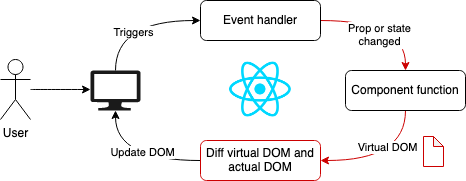
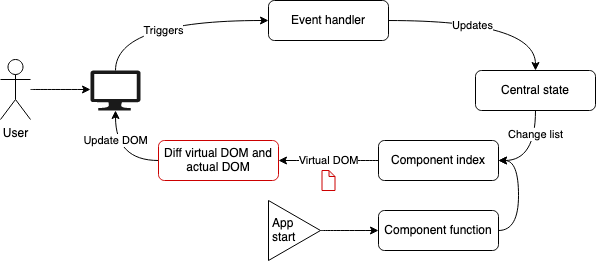
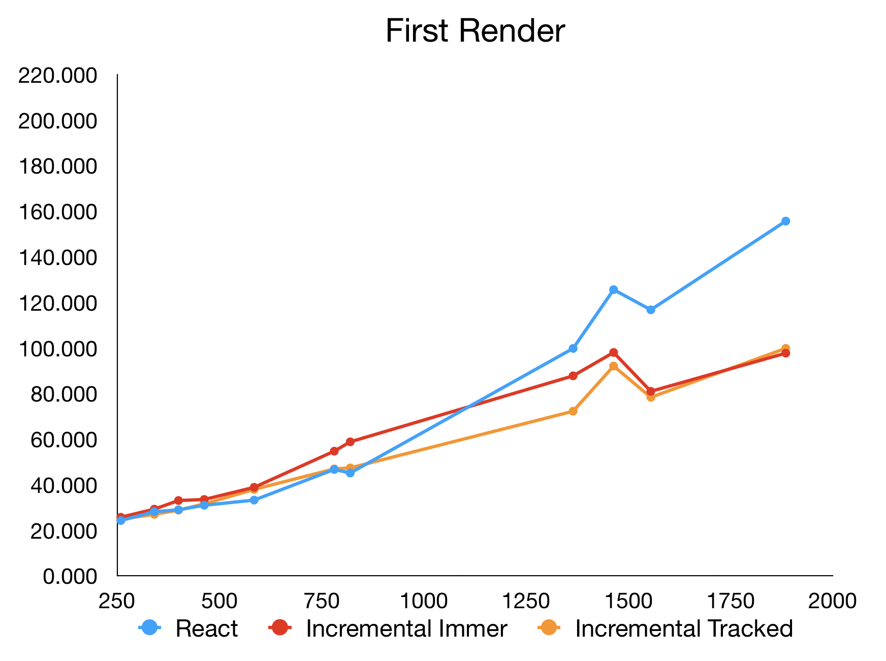
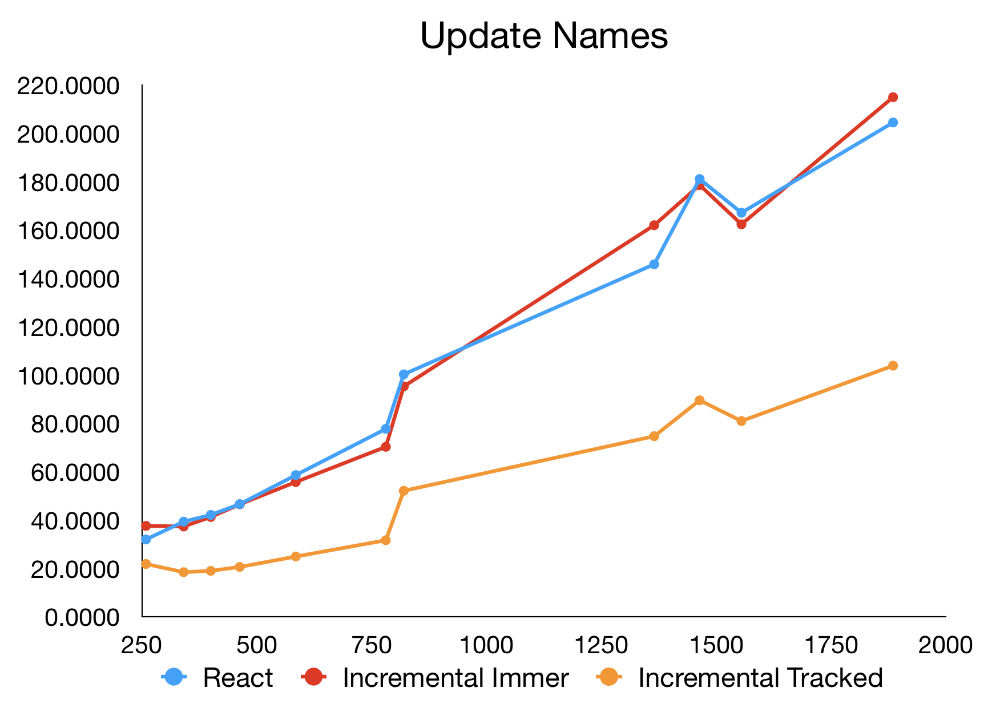
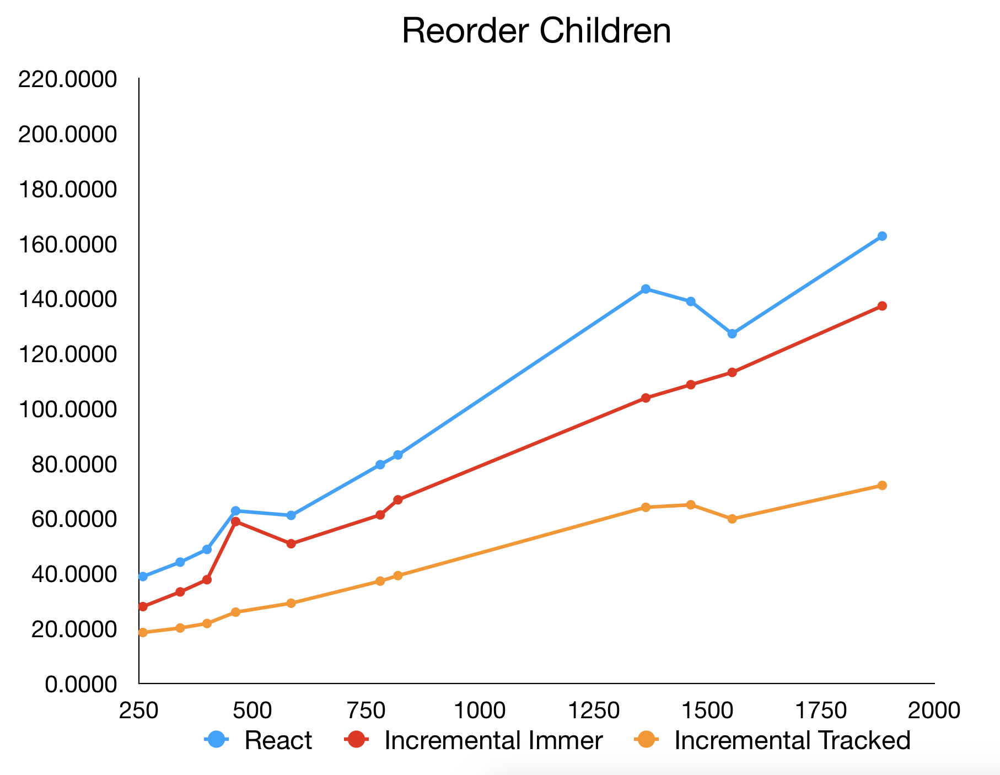

# Incremental

This is a proof of concept of a React inspired frontend framework that has a more efficient
rendering engine. It utilises a built in centralised state and different virtual DOM mechanic to reduce the amount of work
that needs to be done each update.

## React's algorithm

A simplified view of React's engine is that whenever `setState` is called or a property changes, it
triggers a component update. This re-calls the component function with any new properties and state
which generates a new virtual DOM to be diffed against the currently displayed DOM. Any changes
detected are applied to the real DOM. This is pretty efficient most of the time, however, there are
some areas that could be made more efficient with a little redesign. 
When the state is updated via `setState` or your centralised state management library of choice, React doesn't know what has changed. Just that it has changed.
React or various libraries usually perform shallow equality checks to narrow down what has changed.
Once it works out what components need to be updated and has regenerated their virtual DOM, the same
 problem happens again as React doesn't know what in the virtual DOM has changed from is currently displayed.
Recreating virtual DOM trees can also become expensive with large trees and many updates as it just adds to the number of objects that need to be garbage collected.
 
<div align="center">
  
</div>

## My algorithm

The algorithm I've developed works a little differently. Firstly, it uses centralised state constructs
that know how to work out what changed during the update without having to compare the old and new trees in anyway.
After each update we are left with the new state and a list of paths that have changed. The algorithm can then use these paths to work out the parts of the DOM needs to be updated.
When you create a component function with this library, it is only run once when it is first rendered. This produces a "component skeleton" tree that contains all the static DOM as well as computed values
that list the paths in the state that they rely on. When the state has changed and the components need to be re-rendered, the library can use this tree structure to find the computed values
that depend on the changed parts of the state and update them. This turns out to be much faster as it reduces the number of comparisons that need to be done as well as the number of 
redundant objects that need to be created and garbage collected later.

<div align="center">
  
</div>

The first state system I tried utilised the [Immer](https://github.com/immerjs/immer) library which uses proxy
objects to record changes to the state. This provides a very easy to use interface as you write your
state updates as if the state was mutable.
```javascript
function setName(id, name) {
  store.change((state) => {
    state.trees[id].value = name;
  });
}
```

I wanted to know if Immer caused much performance overhead so I also wrote another state system that has
a less magical interface but also has less overhead. It is a set of state modification functions (such as `setAt` below) that
record the parts of the state you update in a transaction.
```javascript
function setName(id, name) {
  store.change((transaction) => {
    setAt(transaction, ['trees', id, 'value'], name);
  });
}
```

The performance of both systems is tested in the benchmarks.

## What's the catch?

The component skeleton is generated by wrapping each prop and state value in a special
placeholder. You then write your component in terms of this placeholder as they can then be used to
work out which parts of your component depend on which parts of the state. Here you can see a simple
example of an Incremental component:
```jsx harmony
const blogPost = (props) => {
  const title = get(state, ['title']);    
  const authorName = get(state, ['author', 'name']);
  const content = get(state, ['content']);

  return (
    <div>
      <h1>{title}</h1>
      <h2>By {authorName}</h2>
      <p>{content}</p>
    </div>
  );  
};
```
It looks almost identical to a normal React component because the placeholders are immediately placed
in the returned JSX structure.

This gets a little more complex when you want to compute something before rendering it to the screen
because each of the values are just placeholders instead of real values. To access the real values
you need to use the `map()` function. 
```jsx harmony
const blogPost = (props) => {
  const title = get(state, ['title']);    
  const authorName = get(state, ['author', 'name']);
  const content = get(state, ['content']);

  const authorDisplay = map(authorName, name => name == null ? 'Anonymous' : `By ${name}`);

  return (
    <div>
      <h1>{title}</h1>
      <h2>{authorDisplay}</h2>
      <p>{content}</p>
    </div>
  );  
};
```

Depending on how complex your components are, this can add some noise which can make them harder to 
read. Theoretically, this step could be avoided with a clever Babel plugin but that is an experiment
for another day.

## Benchmarks

I've created some simple benchmarks to evaluate the proof of concept and so far they show some significant performance gains.
All of the benchmarks work by rendering a simple tree structure then performing some updates on every frame and measuring the time between frames.
The state is updated in the idiomatic way for the particular library being tested.
Updates are performed inside a `requestAnimationFrame()` callback so the minimum time is 16ms. This is
ok because we really only care about the performance when the browser is struggling to keep up 60fps.
Tree sizes from about ~30-1500 elements have been tested to see how the performance changes as the number of nodes grow 

The first benchmark renders a full tree on the first frame, and then clears it and renders nothing on the next one, and then a full tree again and so on.
Since the state is populated and then cleared on every frame, it is mostly a benchmark of the rendering algorithm.
Lower is better.

<div align="center">
  
</div>

There is not a huge difference between the algorithms, but the incremental render pulls slightly ahead on very large trees.


The second benchmark randomly changes a selection of strings displayed in the tree. It benchmarks both the state and rendering systems.
Lower is better.

<div align="center">
  
</div>

The incremental render that uses the Immer.js library is almost identical to React, however the more custom implementation performs extremely well.

The final benchmark randomly reorders children of the tree. It is a similar type of benchmark to the 
previous one, but it also ensures that the shortcuts in the rendering algorithm to relocate existing nodes is performing as expected.
Lower is better.

<div align="center">
  
</div>

## Is it worth it?

The downsides of this algorithm is that requires breaking changes to the way you write components and it is slightly more inconvenient to write them due to the additional level of indirection.
The performance gains in the benchmarks are significant, however it is rare that React apps would require that many updates. React's performance is "good enough" for almost all situations.

All that being said, the gap between the implementations would manifest earlier on mobile devices which continue to dominate web interactions.
Pair this with the fact that web apps are constantly growing in complexity means that one day a more performant framework will be required, and maybe it will look something like this.
While the extra level of indirection can be more difficult to work with it also helps prevent developers from writing slugish code.
Much of the speed of React comes from invisible wrappers such as the `PureComponent` class or the various selector libraries that use memoization to save recomputing values.
These can be easy to forget which makes writing performant code "opt-in" to. This algorithm more-or-less forces you to write performant code from the start and this could prove to be a benefit in the long run.  

# Licence

MIT License

Copyright (c) 2019 James Ferguson

Permission is hereby granted, free of charge, to any person obtaining a copy
of this software and associated documentation files (the "Software"), to deal
in the Software without restriction, including without limitation the rights
to use, copy, modify, merge, publish, distribute, sublicense, and/or sell
copies of the Software, and to permit persons to whom the Software is
furnished to do so, subject to the following conditions:

The above copyright notice and this permission notice shall be included in all
copies or substantial portions of the Software.

THE SOFTWARE IS PROVIDED "AS IS", WITHOUT WARRANTY OF ANY KIND, EXPRESS OR
IMPLIED, INCLUDING BUT NOT LIMITED TO THE WARRANTIES OF MERCHANTABILITY,
FITNESS FOR A PARTICULAR PURPOSE AND NONINFRINGEMENT. IN NO EVENT SHALL THE
AUTHORS OR COPYRIGHT HOLDERS BE LIABLE FOR ANY CLAIM, DAMAGES OR OTHER
LIABILITY, WHETHER IN AN ACTION OF CONTRACT, TORT OR OTHERWISE, ARISING FROM,
OUT OF OR IN CONNECTION WITH THE SOFTWARE OR THE USE OR OTHER DEALINGS IN THE
SOFTWARE.
